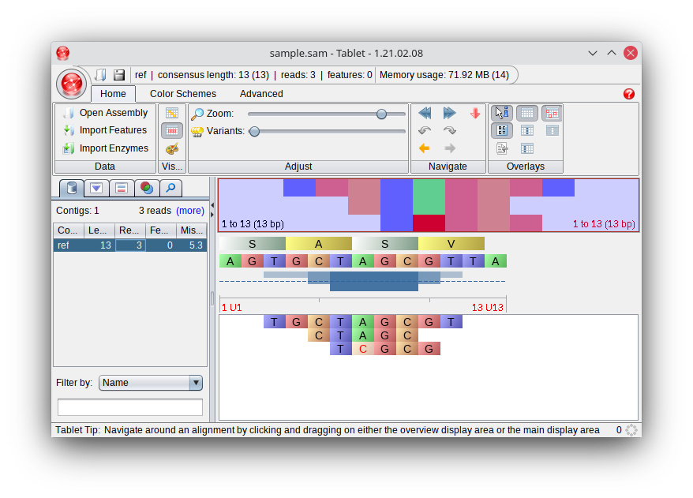
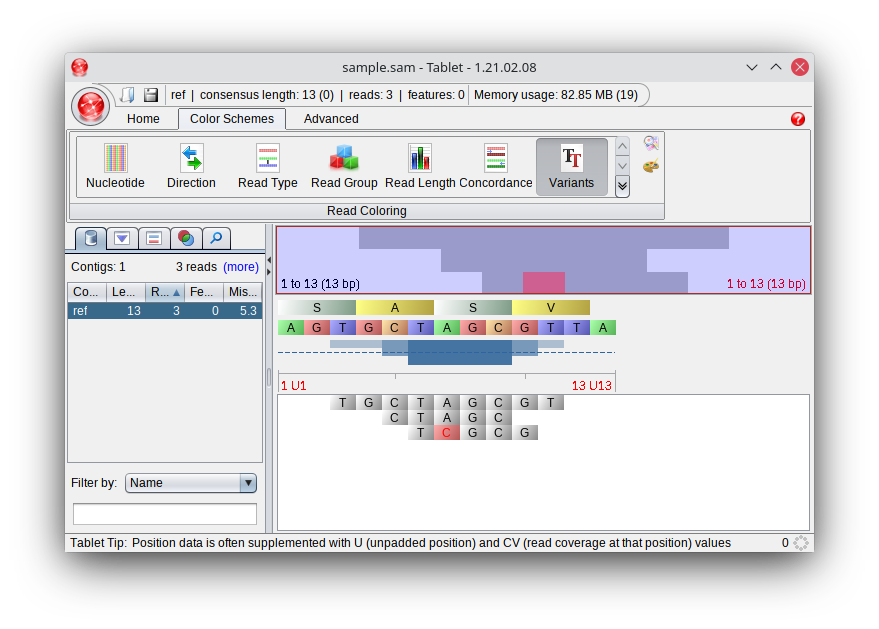

# Mappings und Mutationen

In dieser Aufgabe schauen wir uns an, wie man mehrere Mappings miteinander vergleichen kann, um daraus Unterschiede zwischen Organismen abzuleiten.

## SAM-Format

Zunächst schauen wir uns ein Standard-Format für das Speichern von Mappings an: Das Sequence Alignment/Map (SAM)-Format. Es handelt sich hierbei um ein zeilenbasiertes Format, in welchem jede Zeile einen Read repräsentiert und die Informationen darüber speichert, ob und wenn ja wo er der Referenz zugeordnet werden konnte. Wir konzentrieren uns beim Einlesen und Schreiben auf ein minimales set an features: Den Header sowie 11 Standard-Felder. Hier sehen Sie ein Beispiel einer SAM-Datei:

```text
@SQ SN:ref LN:13
read1   0   ref 3   *    9M  *   0   0   TGCTAGCGT   *
read2   0   ref 5   *    5M  *   0   0   CTAGC  *
read3   0   ref 6   *    1M1X3M *   0   0   TCGCG   *
```

Beachten Sie bitte, dass in SAM-Dateien keine Leerzeichen, sondern Tabs zum Einsatz kommen!

Diese Datei beschreibt das folgende Mapping:

```text
AGTGCTAGCGTTA
  TGCTAGCGT
    CTAGC
     TCGCG
```

In der ersten Zeile - Header-Zeilen sind am führenden @ zu erkennen - wird mittels "@SQ" die Referenzsequenz mit Name (SN:) und Länge (LN:) angegeben.

Die Spalten sind wie folgt definiert:

| Nummer | Name                        | Beschreibung                                                                         |
|---|-----------------------------|--------------------------------------------------------------------------------------|
| 1 | Readname                    | Name des Reads                                                                       |
| 2 | Flag                        | Binärer Flag, beschreibt Zustand des Reads. 0 = gemappt, 4 = nicht gemappt           |
| 3 | Referenzname                | Name der Referenzsequenz                                                             |
| 3 | Position                    | Startposition des Mappings (wo der Read der Referenz zugeordnet ist), 1-based        |
| 4 | Qualität                    | Mapping-Qualität, oder * falls keine Mapping-Qualität berechnet wird                 |
| 5 | CIGAR                       | CIGAR-String. Format: Siehe Dokumentation (am einfachsten: <Länge des Reads>M)       |
| 6 | Nächster Read               | Nächster gemappter Read aus dem Read-Paar. Nur relevant für paired end, sonst *      |
| 7 | Position des nächsten Reads | Position des nächsten gemappten Reads. Nur relevant für paired end, sonst 0          |
| 8 | Template length             | Geschätzte Länge des Templates. Nur relevant für paired end, sonst 0                 |
| 9 | Sequenz                     | Read-Sequenz                                                                         |
| 10 | Basenweise Qualität         | Basenweise Qualität des Mappings, oder * falls Mapping-Qualität nicht berechnet wird |

Die vollständige Dokumentation des SAM-Formats finden Sie auf der [github-Seite von samtools](https://samtools.github.io/hts-specs/SAMv1.pdf). 

Wenn Sie eine funktionierende SAM-Datei haben, können Sie diese zusammen mit der Referenzsequenz beispielsweise in [Tablet](https://ics.hutton.ac.uk/tablet/) visualisieren. Die Beispieldatei oben und die Referenz dazu finden Sie im Ordner data als sample.fasta und sample.sam. Wenn Sie diese in Tablet laden, bekommen Sie folgende Ansicht:



Es gibt in Tablet unterschiedliche Ansichtsoptionen. Stellen Sie beispielsweise im Tab "Color Schemes" das Farbschema auf "Variants" um, werden Unterschiede zur Referenzsequenz farblich hervorgehoben:



## MappingWriter

Implementieren Sie nun zunächst eine Klasse `MappingWriter` mit den folgenden Methoden:

* `__init__(self, mapping)`: Constructor, der ein Mapping-Objekt bekommt
* `write_sam(self, filename)`: Schreibt das Mapping in die übergebene SAM-Datei

Probieren Sie das mit `data/fluA.fasta` und `data/fluA_reads.fasta` aus - Fällt Ihnen etwas auf? Können Sie eventuell Mutationen erkennen? 

# Mutationen erkennen

Um mehrere Datensätze miteinander vergleichen zu können, wäre es aber gut, solche Unterschiede nicht rein mit dem Auge zu erkennen. Um das Erkennen von Mutationen einfacher zu machen, kann ein Mapping auch im pileup-Format geschrieben werden. Im Pileup-Format werden positionsweise die Basen aufgezählt, die in der Referenz sowie in den diese Position abdeckenden Reads vorkommen. Das Pileup des folgenden Alignments (ähnlich wie das obere Alignment, nur mit zwei Abweichungen zwischen Reads und Referenz mehr):

```text
AGTGCTAGCGTTA
  TGCTCGCGT
    CTAGC
     TCGCA
```

sähe wie folgt aus:

```text
ref     1       A       0
ref     2       G       0
ref     3       T       1       .
ref     4       G       1       .
ref     5       C       2       ..
ref     6       T       3       ...
ref     7       A       3       C.C
ref     8       G       3       ...
ref     9       C       3       ...
ref     10      G       2       .A
ref     11      T       1       .
ref     12      T       0
ref     13      A       0
```

Jede Zeile beschreibt eine Position im Referenzgenom, die Zeilen sind aufsteigend nach Position sortiert. Die Spalten sind tabulator-getrennt und enthalten die folgende Information:

| Nummer | Name | Beschreibung |
|---|---|---|
| 1 | Name | Name der Referenzsequenz |
| 2 | Position | Nummer der Base in der Referenzsequenz, beginnend bei 1 |
| 3 | Referenzbase | Base in der Referenzsequenz an dieser Position |
| 4 | Readanzahl | Anzahl der Reads, die diese Position abdecken |
| 5 | Readbasen | Basen in den Reads an dieser Position. `.` für "gleiche Base wie Referenz", sonst die Base des Reads |

Unterschiede zwischen Referenz und Reads lassen sich an diesem Dateiformat deutlich einfacher erkennen und prozessieren.

## Mapping erweitern

Erweitern Sie zunächst die Klasse `Mapping` um eine Methode `get_pileup(self)`, die ein Pileup des Mappings als Array zurückgibt. Dabei soll jedes Element des Arrays die Spalten 2-5 repräsentieren. Beispielsweise wäre das Array für die ersten 7 Zeilen des oben gezeigten pileups wie folgt:

```[[1, 'A', 0, ''], [2, 'G', 0, ''], [3, 'T', 1, '.'], [4, 'G', 1, '.'], [5, 'C', 2, '..'], [6, 'T', 3, '...'], [7, 'A', 3, 'C.C']]```

## MappingWriter erweitern

Nutzen Sie diese Methode um die Klasse `MappingWriter` um eine Methode `write_pileup(self, filename)` zu erweitern. Diese soll eine Pileup-Datei unter dem angegebenen Dateinamen speichern.
