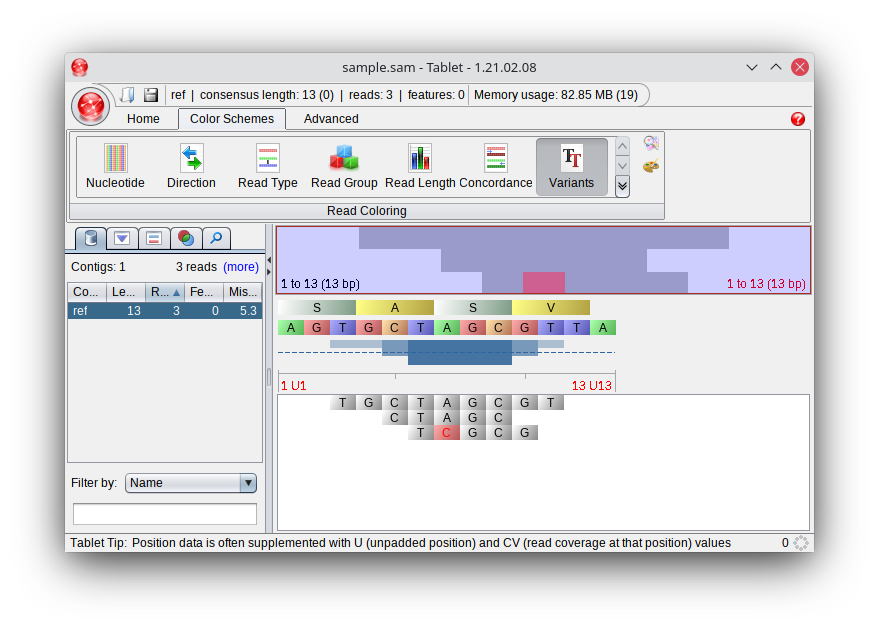

# Mappings and mutations

In this task, we will take a look at how to compare different mappings to each other in order to determine differences between organisms.


## SAM file format

First of all, we are going to look at a stanrads format for saving mappings: The sequence alignment/map (SAM) format. It is a line-based format that saves information about the mapping of a single read in every line. Here, we are going to focus on a minimal feature-set of the format: The header and 11 standard fields. Let's take a look at a sam file:

```text
@SQ SN:ref LN:13
read1   0   ref 3   *    9M  *   0   0   TGCTAGCGT   *
read2   0   ref 5   *    5M  *   0   0   CTAGC  *
read3   0   ref 6   *    1M1X3M *   0   0   TCGCG   *
```

Please note that SAM files do not use spaces but tabs in order to separate fields!

The above file describes the following mapping:

```text
AGTGCTAGCGTTA
  TGCTAGCGT
    CTAGC
     TCGCG
```

The first line - that can be recognized as a header line since it begins with an '@' - describes the reference sequence (@SQ) with its name (SN:) and length (LN:).

The fields in the following non-header lines are defined as follows:

| Number | Name                      | Description                                                                                                  |
|--------|---------------------------|--------------------------------------------------------------------------------------------------------------|
| 1      | Readname                  | Name of the Read                                                                                             |
| 2      | Flag                      | Bnary flag that describes the state of the read. 0=mapped, 4=not mapped                                      |
| 3      | Reference name            | Name of the reference sequence the read was mapped to (must be same as the one given by "SN:" in the header) |
| 4      | Position                  | Start position of the read (i.e. where the read was assigned to the reference), 1-based                      |
| 5      | Quality                   | Mapping quality, or * if no mapping quality was computed by the mapper                                       |
| 6      | CIGAR                     | CIGAR-String. Format: See documentation (in our case simply: <length of the read>M)                          |
| 7      | Next read                 | Next mapped read from the read pair. Only for paired reads, otherwise *                                      |
| 8      | Position of the next read | Position of the next mapped read from the read pair. Only for paired reads, otherwise 0                      |
| 9      | Template length           | Estimated length of the template. Only for paired reads, otherwise 0                                         |
| 10     | Sequence                  | Read sequence                                                                                                |
| 11     | Basewise quality          | Basewise quality of the mapping, or * if the mapper does not compute a mapping quality                       |

The complete documentation of the format can be found on the [github page of samtools](https://samtools.github.io/hts-specs/SAMv1.pdf). 

Once you have a working SAM file and a reference sequence, you can visualize the mapping using many different tools, for instance [Tablet](https://ics.hutton.ac.uk/tablet/). You can find the above example files in the folder data as sample.fasta and sample.sam. If you load those into tablet, you will get the following visualization:


There are different visualization options in tablet. If, for instance, you set the color scheme in the tab "Color Schemes" to "Variants", differences between the reads and the reference will be highlighted:



## MappingWriter

In order to allow you to visualize your mapping results, please first implement a class `MappingWriter` with the following methods:

* `__init__(self, mapping)`: Constructor that gets a `Mapping` object
* `write_sam(self, filename)`: Saves the mapping to the provided SAM file

Try the whole process (including visualization in Tablet) with `data/fluA.fasta` and `data/fluA_reads.fasta`. Can you notice something interesting? Can you recognize mutations? 

# Recognizing mutations

In order to compare different datasets with each other, it would be good not to rely on recognizing such differences just by looking at a visualization. In order to make mutation detection easier, a mapping can also be saved in the pileup format. This format lists all positions in the genome line by line. The pileup of this mapping:

```text
AGTGCTAGCGTTA
  TGCTCGCGT
    CTAGC
     TCGCA
```

looks like this:

```text
ref     1       A       0
ref     2       G       0
ref     3       T       1       .
ref     4       G       1       .
ref     5       C       2       ..
ref     6       T       3       ...
ref     7       A       3       C.C
ref     8       G       3       ...
ref     9       C       3       ...
ref     10      G       2       .A
ref     11      T       1       .
ref     12      T       0
ref     13      A       0
```

Each line describes a position in the reference genome, the lines are sorted by position. The columns are tab-separated and contain the following information:

| Number | Name            | Description                                                                                                          |
|--------|-----------------|----------------------------------------------------------------------------------------------------------------------|
| 1      | Name            | Name of the reference sequence                                                                                       |
| 2      | Position        | Number of the base in the reference sequence, beginning with 1                                                       |
| 3      | Reference base  | Base in the reference sequence at this position                                                                      |
| 4      | Number of reads | Number of reads covering this position                                                                               |
| 5      | Read bases      | Bases in the reads at this position. "." if it is the same base as in the reference, otherwise the base in the read. |

In this format, it is much easier to determine and process differences between reads and reference. 

## Extension of the Mapping class

In order to allow writing this format, please first extend the class `Mapping` by a method `get_pileup(self)` that returns the pileup of a mapping as an array. Each element of that array should represent columns 2-5 of the pileup file. For instance, the array for the first 7 lines of the above pileup file would be:

```[[1, 'A', 0, ''], [2, 'G', 0, ''], [3, 'T', 1, '.'], [4, 'G', 1, '.'], [5, 'C', 2, '..'], [6, 'T', 3, '...'], [7, 'A', 3, 'C.C']]```

## Extension of the MappingWriter class

Now, you can use this method to extend the class `MappingWriter` by a method `write_pileup(self, filename)` that saves the mapping as a pileup file.